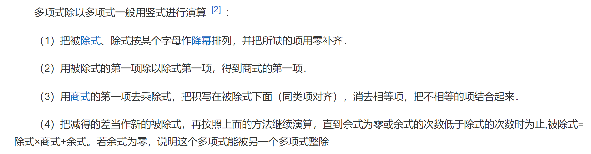
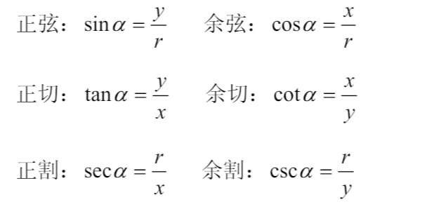
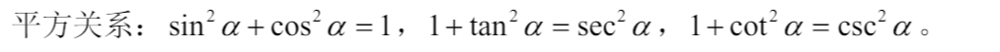
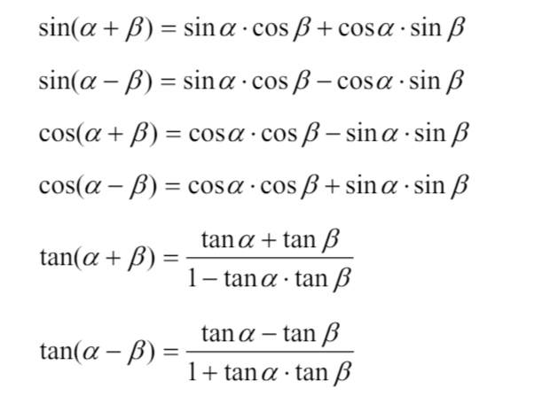
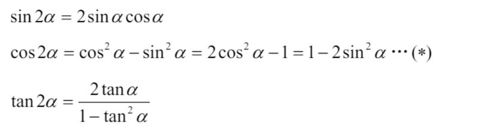
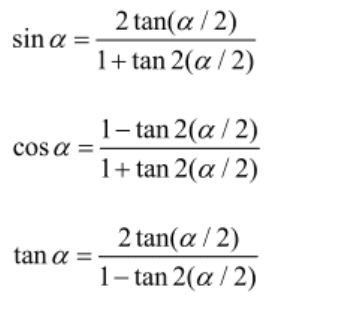
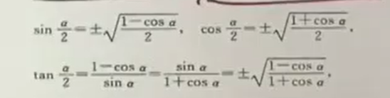

**多项式除法**

**三角函数公式**  

  

5. $arcsin x + arccos x = \frac{\pi}{2} (-1 \le x \le 1)$

**等差数列**  
1. 前n项和$S_n = a_1n+\frac{n(n-1)d}{2} = \frac{(a_1+a_n)n}{2}$

**等比数列**  
1. 前n项和$\frac{a_1(1-r^n)}{1-r}$
2. 常用 $1+r+r^2+...+r^{n-1} = \frac{1-r^n}{1-r}$

**常见前n项和**  
1. $1^2+2^2+3^2+...+n^2 = \frac{n(n+1)(2n+1)}{6}$

**一元二次方程** 
- 韦达定理  
$x_1+x_2 = -\frac{b}{a} $
$x_1x_2 = \frac{c}{a}$  

**因式分解公式**  
$(a+b)^3 = a^3+3a^2b+3ab^2+b^3$
$(a-b)^3 = a^3-3a^2b+3ab^2-b^3$
$a^3+b^3 = (a+b)(a^2-ab+b^2)$
$a^3-b^3 = (a-b)(a^2+ab+b^2)$  

**常用不等式**  
- $|a\pm b \le |a|+|b| \\ ||a|-|b||\le |a-b|$  
- $\sqrt{ab}\le\frac{a+b}{2}\le\sqrt{\frac{a^2+b^2}{2}} \\ \sqrt[3]{abc}\le\frac{a+b}{2}\le\sqrt{\frac{a^2+b^2+c^2}{3}} \\ |ab| \le \frac{a^2+b^2}{2}$
- $sinx < x <tanx(0<x<\frac{\pi}{2)}$
- $sinx < x(x>0)$
- $arctanx \le x \le arcsinx (0 \le x \le1)$
- $e^x \ge x+1$
- $x-1 \ge lnx$
- $\frac{1}{x+1}<ln(1+\frac{1}{x})<\frac{1}{x} (x>0)$