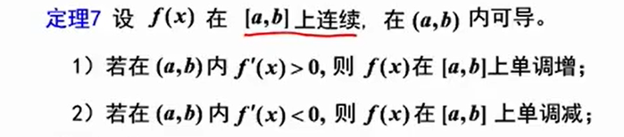
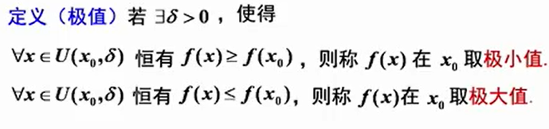
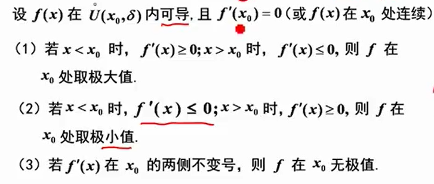
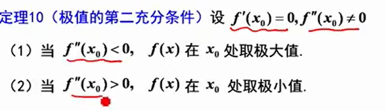
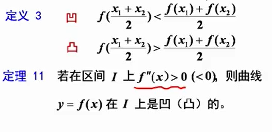
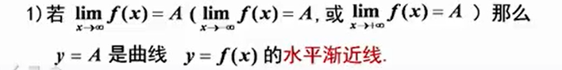
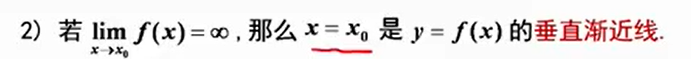
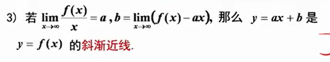

 1. 定理一(费马定理)
$如果函数f(x)在x_0处可导，且在x_0处取得极值,那么f'(x_0) = 0$

2. 定理二(罗尔定理)
   1. $f(x)在[a,b]上连续$
   2. $f(x)在(a,b)内可导$
   3. $f(a) = f(b)$  
$则\exist\xi\in(a,b),使f'(\xi) = 0$

3. 定理3(拉格朗日定理)
    1. $f(x) 在[a,b]上连续$
    2. $f(x)在(a,b)内可导$
$$则存在\exist\xi\in(a,b),使\\ \frac{f(b)-f(a)}{b-a} = f'(\xi)$$

4. 定理4(柯西定理)
    1. $f(x),F(x) 在[a,b]上连续$  
    2. $f(x),F(x)在(a,b)内可导,且F'(x)\neq 0$
$$则\exist\xi\in(a,n),使\\\frac{f(b)-f(a)}{F(b)-F(a)} = \frac{f'(\xi)}{F'(\xi)}$$

5. 泰勒公式

6. 函数单调性 

7. 函数极值

    - 必要条件  
    $若f(x)在x_0处可导，且在x_0处取得极值 \rightarrow f'(x) = 0$
    - 充分条件
     
    

8. 函数的最大最小值
   - 求f(x)在[a,b]上的最值
        1. $求出f(x)在[a,b]上的驻点和不可导的点 x_0,x_1,\dots x_n$
        2. $求出函数值f(x_0),f(x_1),\cdot f(x_n)$
        3. 比较以上各点函数值  

9. 曲线凹凸性
    
    - 拐点

10. 渐进线
      
    
    

11. 曲率和曲率半径