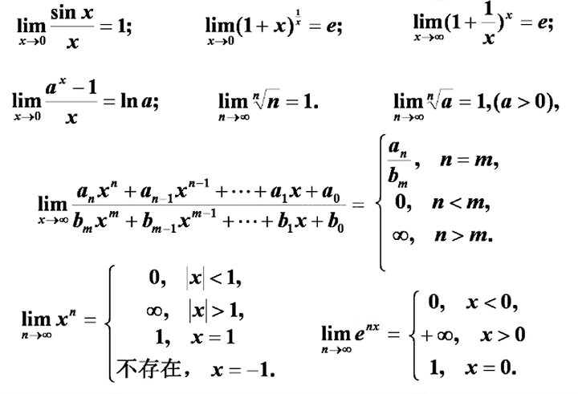
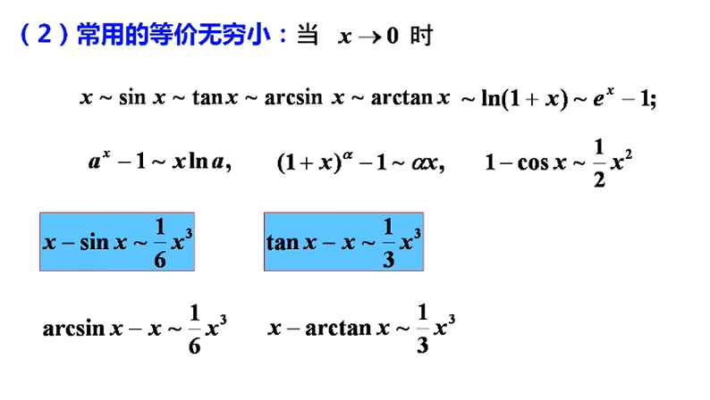
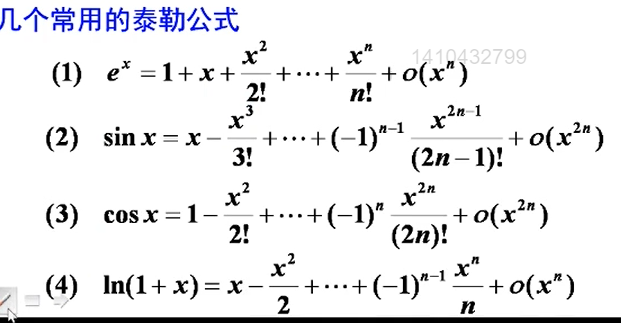
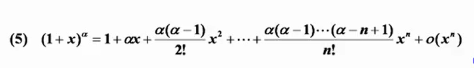

1. 利用基本函数求极限
- 
- $$1^\infty常用理论$$
  - $$若\lim\alpha(x) = 0,\lim\beta(x) = \infty,且 \lim\alpha(x)\beta(x) = A 则 \lim(1+\alpha(x))^\beta(x) = e^A$$
  - 归纳  
    - $$写标准形式\ \ \ 原式 = \lim[1+\alpha(x)]^{\beta(x)}$$
    - $$求极限 \lim\alpha(x)\beta(x) = A$$
    - $$写结果 原式 = e^A$$

2. 利用等价无穷小代换求极限
  - 代换原则
    - **乘除**关系可以换
      - $$若\alpha \sim \alpha1，\beta \sim \beta1则\\\lim\frac{\alpha}{\beta} = \lim\frac{\alpha1}{\beta} = \lim\frac{\alpha}{\beta1} = \lim\frac{\alpha1}{\beta1}$$
    - 加减关系在一定条件下可以换(两个减项不等价)
      - $$\alpha \sim \alpha1，\beta \sim \beta1，且\lim\frac{\alpha1}{\beta1} = A \ne 1,则\alpha - \beta \sim \alpha1 - \beta1$$
  - 常用的等价无穷小
    - 
    - $$1-cos^\alpha x \sim \frac{\alpha}{2}x^2\\ 原式 = 1 - [1-cos^\alpha+1]$$
3. 利用有理运算法则求极限(**前提是极限必须是存在的**)
   - $$\lim f(x) = A,\lim g(x) = B\\ \\
   \lim(f(x)\pm g(x)) = \lim f(x) \pm g(x)\\ \\ \lim(f(x)*g(x)) = \lim f(x) * \lim g(x) \\ \lim\frac{f(x)}{g(x)} = \frac{\lim f(x)}{\lim g(x)} (B\neq 0)$$
      - $$存在 \pm 不存在 = 不存在 $$
      - $$不存在 \pm 不存在 = 不一定 $$
      - $$存在 \times \div 不存在 = 不一定 \\(\lim_{x \rightarrow \infty}\frac{1}{n}(存在)\times \lim_{x \rightarrow\infty} n(不存在) = 1) $$
      -  $$不存在 \times \div 不存在 = 不一定 \\ (-1)^n \cdot (-1)^n = (-1)^{2n}$$
   - $$\lim f(x) = A \neq 0 \Rightarrow \lim f(x)g(x) = A \lim g(x)$$
   - $$\lim \frac{f(x)}{g(x)} 存在，\lim g(x) = 0 \Rightarrow \lim f(x) = 0 \\ 证：\frac{f(x)}{g(x)} * g(x) = f(x) \rightarrow 0$$
   - $$\lim \frac{f(x)}{g(x)} = A \neq 0,\lim f(x)  = 0 \Rightarrow \lim g(x) = 0+o(x-x_0)^n$$

4. 洛必塔法则求极限(使用前提是 $\frac{0}{0} or \frac{\infty}{\infty}$ )
  - **使用前提条件**
    1. $lim_{x \rightarrow x_0}f(x) = 0(\infty)$  
    2. $f(x)和g(x)在x_0的某去心领域可导,且g'(x) \ne 0$
    3. $\lim_{x \rightarrow x_0} \frac{f'(x)}{g'(x)} 存在(或\infty)$
  - 适用类型
    - $$\frac{0}{0}; \frac{\infty}{\infty};0*\infty;\infty - \infty;1^\infty;\infty^0;0^0$$
5. 利用泰勒公式求极限
   - $$设f(x)在x = x_0处n阶可导，则\\f(x) = f(x_0)+f'(x_0)(x-x_0)+\dots+\frac{f^{(n)}(x_0)}{n!}(x-x_0)^n$$
   
   
6. 利用夹逼定理求极限
7. 利用单调有界准则求极限
   - $$2ab \leq a^2+b^2$$
8. 利用定积分定义求极限