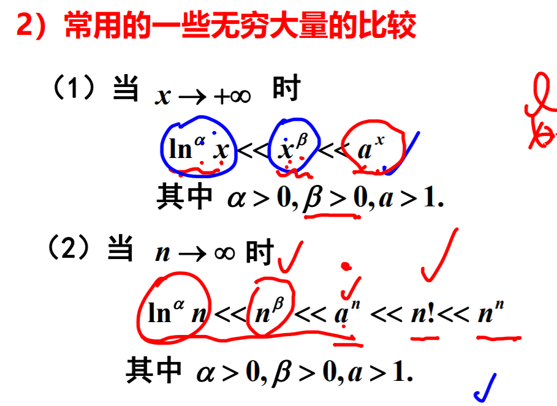

**有界性**
- 数列
  - $$ \{x_n\}收敛 \rightarrow \{x_n\}有界$$
- 函数
  - $$ \lim_{x \rightarrow x_0}f(x)存在 \rightarrow f(x)在x_0的去心领域有界$$  
- $$注意不能逆推 \lim_{x \rightarrow 0}sin\frac{1}{x} 有界但是极限不存在$$
 
**保号性**  
- 数列
  - $$数列设 \lim_{n \rightarrow \infty}x_n = A$$
    - $$如果A>0，当n>N 时，x_n \ge 0,则存在N>0,当n>N时 x_n >0 反之亦然$$
    - $$如果存在N>0,当n>N是,x_n \ge 则 A
    \ge 0$$
    - **注意这两个概念是否带有等于号**   
 
- 函数
    - $$函数 \lim_{n\rightarrow x_0}x_n = A$$
    - $$如果A>0 则存在 \delta>0,当 x\in U(x_a,\delta)时，f(x) > 0$$
    - $$如果存在\delta>0,当x\in U(x_a,\delta)时，f(x) \ge0, A \ge0$$  

**夹逼定理**
  - $$若存在N,当 n>N是,x_n\le y_n \le z_n，且 \lim_{n\rightarrow\infty}x_n = \lim_{n\rightarrow\infty}z_n = a,则\lim_{n\rightarrow\infty}y_n = a$$
**单调有界准则**
  - 单调有界数列必定有极限
    - 单调递增、有上界的数列必有极限
    - 单调减、有下界的数列必有极限

**极限和无穷小的关系**  
  - $$\lim f(x) = A \Leftrightarrow f(x) = A+\alpha(x) 其中 \lim\alpha(x) = 0$$
**无穷小的性质**
  - **有限个**无穷小的和依然是无穷小
  - **有限个**无穷小的积仍是无穷小
  - 无穷小与有界量的积仍是无穷小  

**无穷大的性质**
  - 有限个无穷大的积任然是无穷大
  - $有限个无穷的的合不一定为无穷大，因为 +\infty + -\infty$
  - 一个无穷的大 + 有界变量仍然为无穷大
  

- 无穷大与无界变量的关系 
  - $一个数列是无穷大量 \rightarrow 数列是无界变量$
  - 无穷大量必为无界变量，而无界变量不一定为无穷大量
- 无穷大与无穷小的关系
  - $$ 如果f(x)是无穷大 \rightarrow \frac{1}{f(x)}是无穷小,反之,如果f(x) 是无穷小 \nrightarrow \frac{1}{f(x)} 是无穷大，只有f(x)在取极限的时候趋向于0，但不等于0时才成立，反例为f(x)\equiv 0时$$