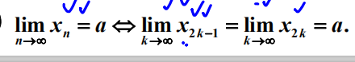

**定理2**  
$$\lim_{x\rightarrow x_0} = A \Leftrightarrow \lim_{x \rightarrow x_0^- }
= \lim_{x \rightarrow x_0^+}f(x) = A$$

**该定理主要用于三种情况**  
1. 分段函数在分界点处的极限(该分界点两侧函数表达式不同)
2. $$e^\infty 型极限 (如 \lim_{x \rightarrow 0} e^\frac{1}{x} $$
3. $$arctan\infty 型极限$$

**负无穷和正无穷的极限有 差别**