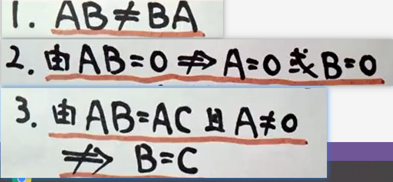

**矩阵**  
- 矩阵加法 
$A+B = B+A \\ (A+B)+C = A+(B+C)$  

- 矩阵乘法
  1. $(AB)C = A(BC)$  
  2. $\lambda(AB) = (\lambda A)B = A(\lambda B)$  
  3. $A(B+C) = AB+AC,(B+C)A = BA+CA$
  

- 转置矩阵 
    
    1. $(A^T)^T = A$
    2. $(A+B)^T = A^T+B^T$
    3. $(\lambda A)^T = \lambda A(T)$
    4. $(AB)^T = B^TA^T$