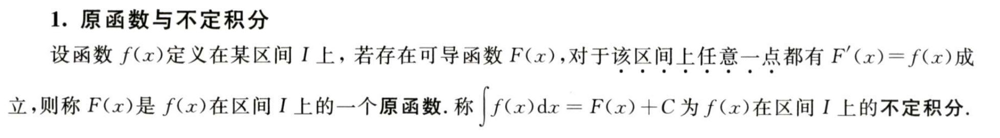

**不定积分的概念与性质**

-   补充
    -   原函数一定要指明区间，且每一个点都成立
    -   连续一定存在原函数
    -   含有第一类间断点和无穷间断点的函数$f(x)$在包含该间断点的区间内必没有原函数
    -   有第二类振荡间断点的函数，可能存在原函数  
    -   f(x)连续，则原函数存在与否与定积分存在与否可以不相干

**不定积分性质**
  - f(x)是连续奇函数，则$\int^x_0f(x)dx和\int^x_af(x)dx(a\ne 0)$都为偶函数
  - f(x)是连续偶函数，只有$\int^x_0f(x)dx$是奇函数
  - 