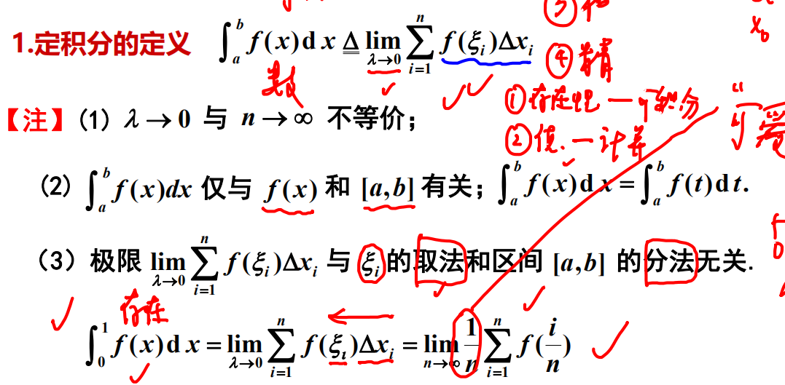

**定积分定义**  

- 考点  
    - n项式求和极限
        1. 先提出$\frac{1}{n}$
        2. 再凑出$\frac{i}{n}$
- 补充  
    - 区分可积和有原函数的区别

**定积分存在条件** 
- 充分条件 

- 必要条件  
    - 如果定积分$\int^b_af(x)dx$存在，则$f(x)在[a,b]$上必有界。
- 补充  
    - 无穷间断点和无界振荡点不存在定积分
    - 有界振荡点存在定积分

**定积分的性质**
- $\int^b_adx = b-a$
- $若在区间[a,b]上f(x)\le g(x)，则有\int^b_af(x)dx \le \int^b_ag(x)dx$
