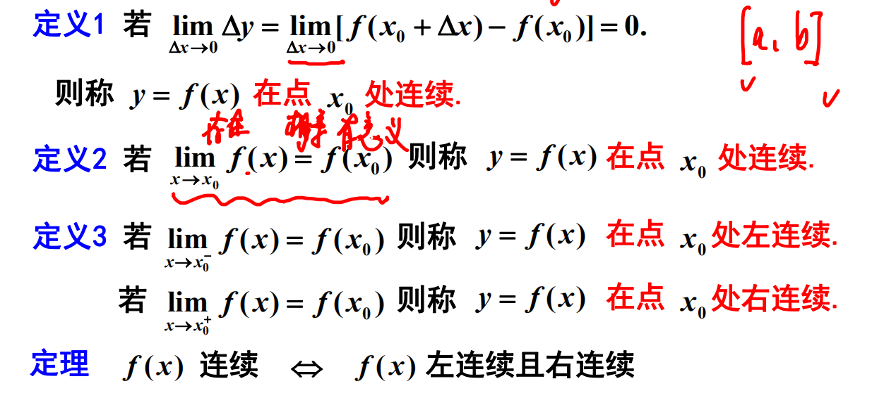
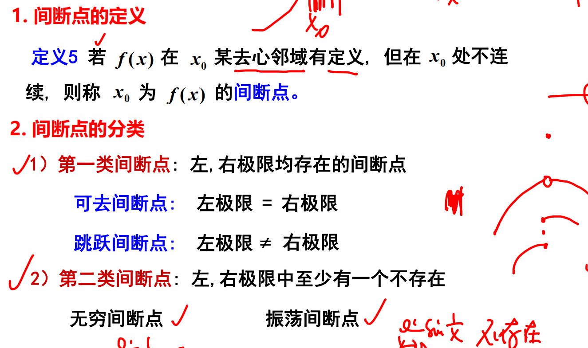
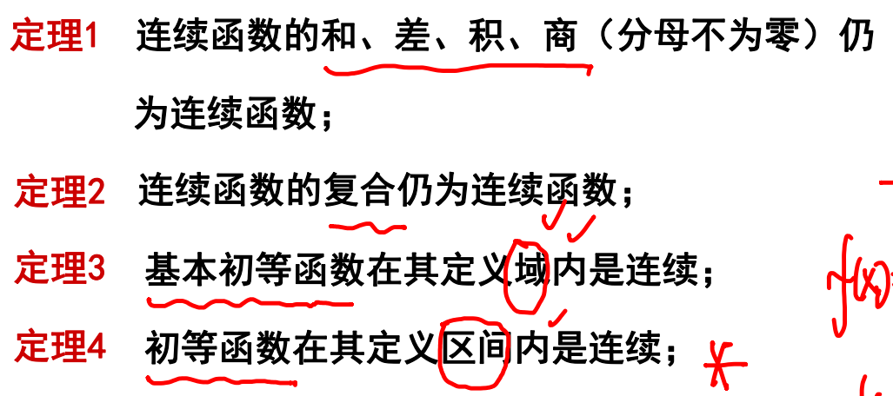

**函数连续性**  
  

**间断点极其分类**  

- 考点  
    - 间断点分类  
        1. 判断点左右的的极限是否存在
            - 存在且不等于无穷(第一类间断点)  
                - 判断左右极限是否相等，不相等为跳跃间断点。
                - 相等判断左右极限是否等于$f(x_0)，不等为可去间断点
            - 不存在或等于无穷(第二类间断点)  
                - 两边等于无穷是无穷间断点
                - 两边振荡不存在为振荡间断点

**连续性的运算和性质** 

