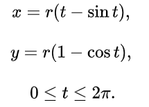

**函数图像变化** 
- 直角坐标系 
  1. 函数左右平移
  2. 函数上下平移
  3. $-f(x) 和 f(x)$关于x轴对称，$f(x)和f(-x)$关于y轴对称。$-f(-x) 和 f(x)$ 关于原点对称。 $f^{-1}(x) 和 f(x)$关于y = x对称。 
  4. $|f(x)| 和 f(|x|)$的区别。考虑$|sinx| 和 sin|x|$的图像
  5. 伸缩

- 极坐标画法  
  1.  画直角坐标系下的r,$\theta$图
  2.  对应到极坐标系下

- 参数方程常见  
1. 摆线

2. 星型线($x^\frac{2}{3} + y^\frac{2}{3} = r^\frac{2}{3}$)  
    - $x = rcos^3t$
    - $y = rsin^3t$