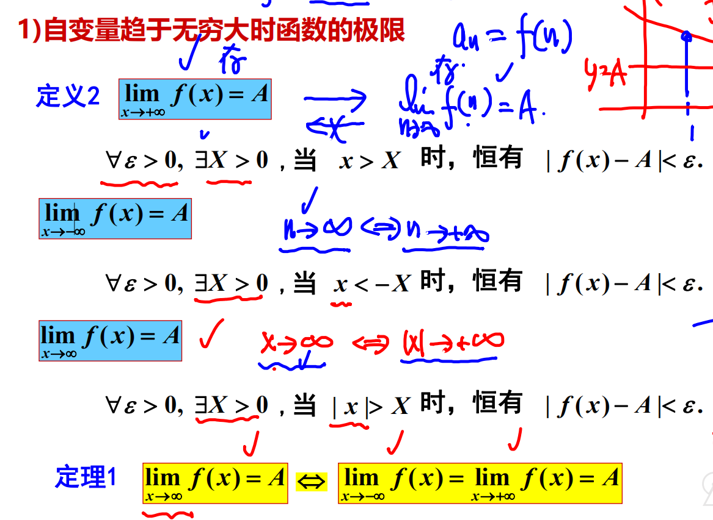

**数列极限**  
  

$N的值随\varepsilon的改变而改变$
$数列极限的\{x_n\}的极限与前有限项无关$  
- 考点  
    - 定义证明极限存在  
      1. 先写$|x_n-A |< \varepsilon$
      2. 不等式建立之后反解n的范围
      3. $N = [n]+1$  
      - 注意变量范围
    - 即可用数列极限存在证明其子数列极限存在，也可用其子数列极限不存在或极限不相等证明数列极限不存在

**函数极限**  

- $\lim_{x \rightarrow x_0}$与$x_0$点无关

  
3. $$\lim_{x\rightarrow x_0}f(x) = A+\alpha(a)$$

- 考点  
  - 求极限
  - 证明极限存在  
  - 用一极限证明另一极限

**需要分左右极限求极限问题三种情况**  
1. 分段函数在分界点处的极限(该分界点两侧函数表达式不同)
2. $$e^\infty 型极限 (如 \lim_{x \rightarrow 0} e^\frac{1}{x}) $$
3. $$arctan\infty 型极限$$
4. 极限存在绝对值
5. 取整函数

