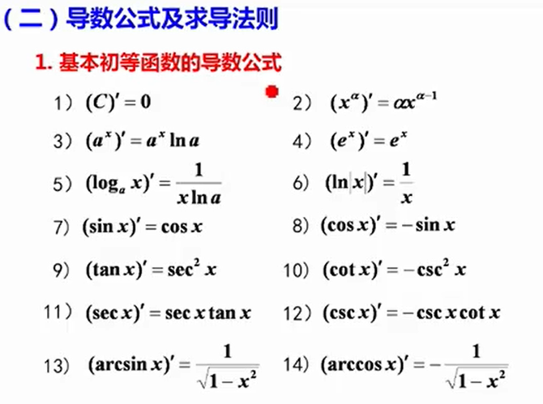
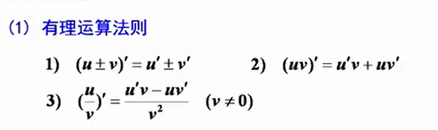
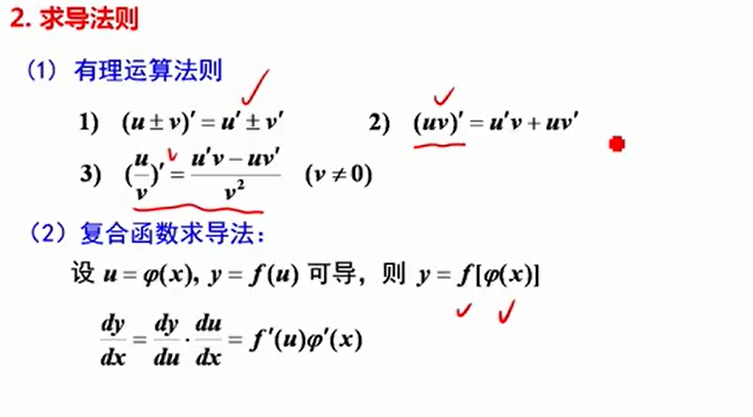
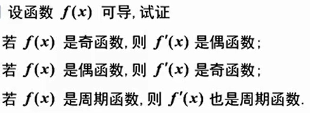
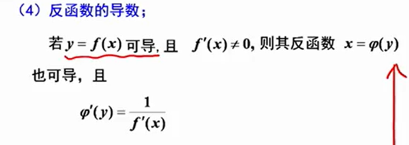
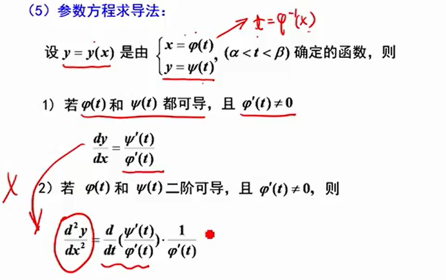
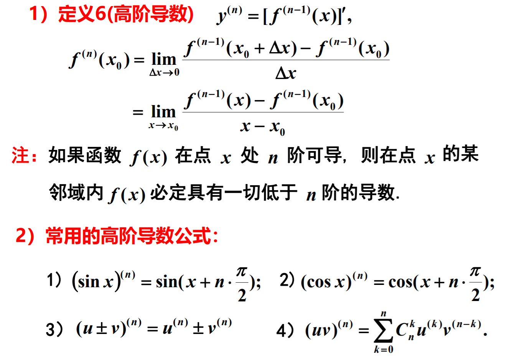

## 3. 隐函数求导

- 补充  
    - $y_{xx}'' = -\frac{x_{yy}''}{(x_y')^2}$

6.对数求导法
- 对函数两边取对数再求导
- 注意取值范围

7.高阶导数

  - 补充  
    - $lnx^{(n)} = (-1)^{n-1}\frac{(n-1)!}{(1+x)^n}(x>0)$
    - $(\frac{1}{(x+a)})^{(n)} = \frac{(-1)^nn!}{(x+a)^{n+1}}$
    - 可用泰勒公式求

- 考点  
    - 基本求导  
        1. 运用基本求导公式和导数的四则运算
    - 分段函数求导  
        1. 分段点用导数定义求导，判断该点导数是否存在和值
        2. 非分段点运用导数公式求导