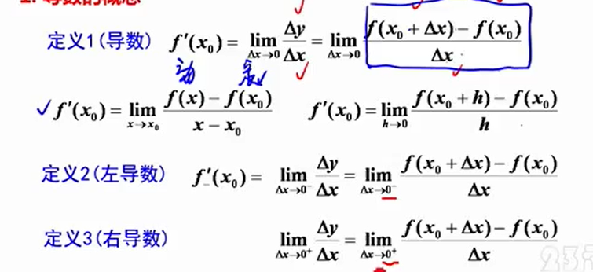
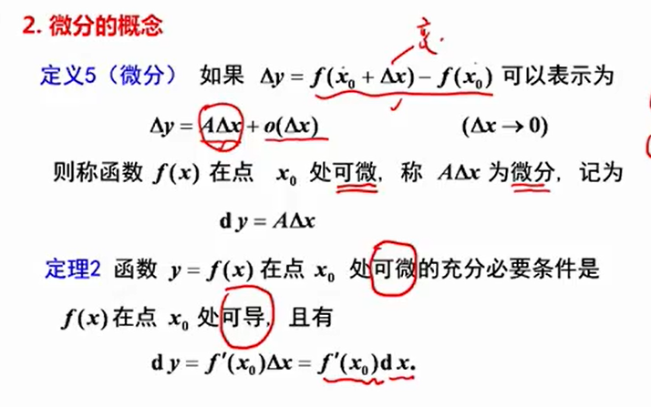
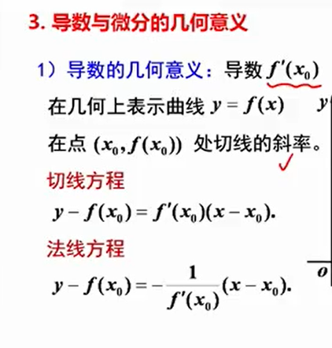
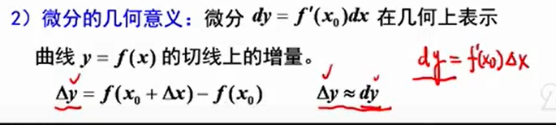

### 导数概念

- 补充  
    - 设f(x)在$x = x_0$处连续，若满足$\lim_{x\rightarrow x_0}\frac{f(x)}{x-x_0} = A，则f(x) = 0,f(x_0)' = A$

- 可微判定  
    1. 写增量 $\Delta y = f(x_0+\Delta x)+ f(x_0)$
    2. 写线性增量 $A\Delta x = f'(x_0)\Delta x$
    3. 做极限$\lim_{\Delta x \rightarrow 0}\frac{\Delta y - A\Delta x}{\Delta x} $
    4. 若极限等于0，则可微

