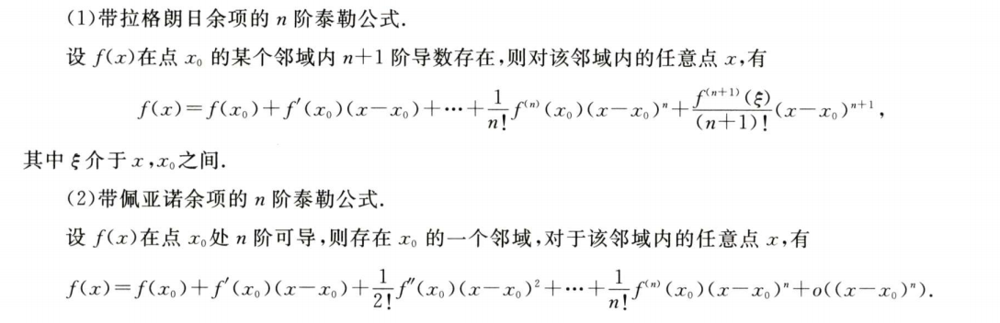
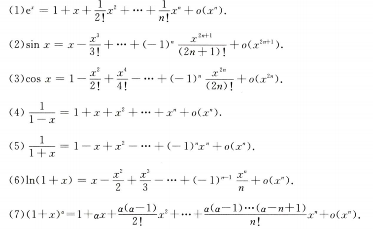

**函数相关定理**  
$前提是f(x)在区间[a,b]上连续$
1. 有界和最值定理  
$f(x)一定存在最大值和最小值，使得m\le f(x) \le M$
2. 介值定理  
$当m \le \mu \le M,一定存在\xi\in[a,b],使得f(\xi) = \mu$
3. 平均值定理  
$当 a<x_1 <x_2<...<x_n<b,在[x_1,x_n]，内至少存在一点\xi,使得 \\ f(\xi) = \frac{f(x_1) +f(x_2)+...+f(x_n)}{n} $

4. 零点定理  
$当f(a)*f(b)<0时，存在\xi\in(a,b),使得f(\xi) = 0$

**导数相关定理**    
1. 费马定理
$如果函数f(x)在x_0处可导，且在x_0处取得极值,那么f'(x_0) = 0$

2. 罗尔定理
   1. $f(x)在[a,b]上连续$
   2. $f(x)在(a,b)内可导$
   3. $f(a) = f(b)$  
$则\exist\xi\in(a,b),使f'(\xi) = 0$
    - 补充  
        1. f(a) = f(b)可以变为  
            - $\lim_{x \rightarrow a^+}f(x) = \lim_{x \rightarrow b^-}f(x) =A$
            - $\lim_{x \rightarrow a^+}f(x) = \lim_{x \rightarrow b^-}f(x) = \pm\infty$
            - $\lim_{x \rightarrow a^+}f(x) = \lim_{x \rightarrow +\infty}f(x) = A$
            - $\lim_{x \rightarrow -\infty}f(x) = \lim_{x \rightarrow +\infty}f(x) = \pm\infty$

    - 考点  
        - 证明  
            - 辅助函数的构造    
                1. $(uv)' = u'v+uv'$的逆运用来构造辅助函数
                   1. $(f(x)f(x))' = 2f(x)f'(x) \\ 即F(x) = f^2(x)$
                   2. $[f(x)f'(x)]' = [f'(x)]^2 +f(x)f''(x) \\ 设F(x) = f(x)f'(x)$
                   3. $[f(x)e^{\varphi(x)}]' = f'(x)e^{\varphi(x)} + f(x)e^{\varphi(x)}\varphi '(x) = (f'(x) + f(x)\varphi '(x))e^{\varphi(x)} \\ 设F(x) = f(x)e^{\varphi(x)}$
1. 定理3(拉格朗日定理)
    1. $f(x) 在[a,b]上连续$
    2. $f(x)在(a,b)内可导$
$$则存在\exist\xi\in(a,b),使\\ \frac{f(b)- f(a)}{b-a} = f'(\xi)$$
 - 考点  
     - 证明  
         1. 见到$f和f'的关系往往考虑该定理$
         2. 见到$f-f往往考虑该定理$
1. 定理4(柯西定理)
    1. $f(x),F(x) 在[a,b]上连续$  
    2. $f(x),F(x)在(a,b)内可导,且F'(x)\neq 0$
$$则\exist\xi\in(a,n),使\\\frac{f(b)-f(a)}{F(b)-F(a)} = \frac{f'(\xi)}{F'(\xi)}$$

5. 泰勒公式  

1. 积分中值定理    
$f(x)在[a,b]上连续，存在\xi\in[a,b],使得f(\xi)\\ \int^b_af(x)dx = f(\xi)(b-a)$  
   - 补充 
   $\xi\in(a,b)中该定理也成立$  
   - 考点  
       - 证明  
           1. 见到定积分$\int^b_af(x)dx$，一般采用两种方法  
               1. 用中值定理处理改成$f(\xi)(b-a)$
               2. 改成$F(x) = \int^x_af(t)dt$

- 考点  
    - 证明  
        - 连续则代表有最大最小值
    - 零点问题  
        - 零点定理(主要证明根的存在性)
        - 单调性(证明根的唯一性)  
            - 注意区分原函数的导数是否含参，含参要注意讨论参数
        - 罗尔原话(若$f^{(n)}$最多有k个根，则f(x) = 0最多有k+n个根)
        - 实系数奇次方程至少有一个实根
    - 微分不等式  
        - 单调性
        - 最值
        - 凹凸性  
        - 常数变量化
        - 中值定理  