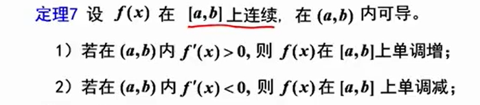
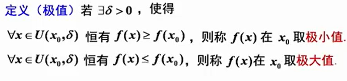
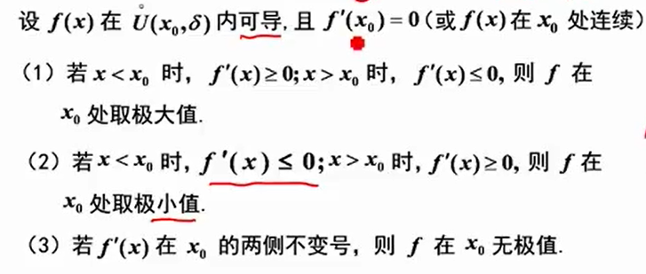
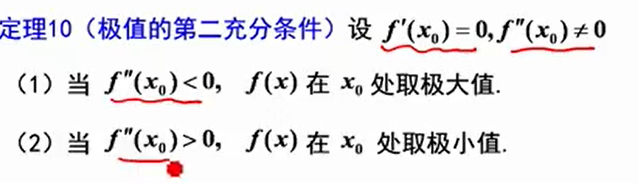
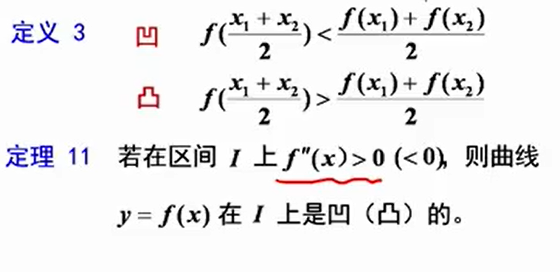
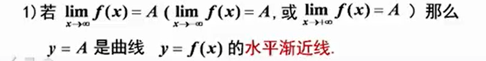
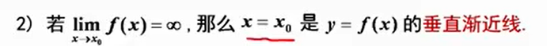
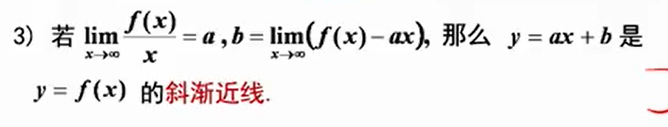
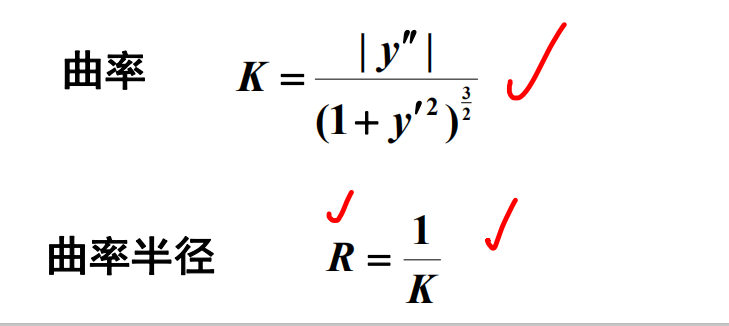

1. 函数单调性 

7. 函数极值

    - 必要条件  
    $若f(x)在x_0处可导，且在x_0处取得极值 \rightarrow f'(x) = 0$
    - 充分条件
    
      - 不要在$x_0$处可导，但一定要连续 
    
      - 第三充分条件         
        设$f(x)$在$x_0$处n阶可导，且$f^{(m)}(x_0) = 0(m = 1,2,3,..,n-1),f^{(n)}(x_0)\ne 0$，则  
        1. n为偶数，且$f^{(n)}(x_0)<0,f(x)在x_0处取极大值$
        2. n为偶数，且$f^{(n)}(x_0)>0,f(x)在x_0处取极小值$  

    - 考点  
        - 求曲线的极值点
1. 函数的最大最小值
   - 求f(x)在[a,b]上的最值
        1. $求出f(x)在[a,b]上的驻点和不可导的点 x_0,x_1,\dots x_n$
        2. $求出函数值f(x_0),f(x_1),\cdot f(x_n)$
        3. 比较以上各点函数值 
    - 补充  
        1. 最值不一定是极值
        2. 极值点处不一定是最值点   
        3. 如果$x_0$是f(x)在区间I上的最值点，且该点是区间内部的点，不是区间的端点，那么$x_0$必定是极值点
        4. 不要忘记定义式   

    - 考点 
        - 求闭区间中的最大最小值  
            1. 找到(a,b)驻点和不可导的点，并求出求出这些点的函数值
            2. 求出端点$f(a)和f(b)$
            3. 比较上述点得最大最小值
        - 求开区间中的最大最小值  
            1. 找到(a,b)驻点和不可导的点，并求出求出这些点的函数值
            2. 求a,b两端的单侧极限
            3. 确定最值或取值范围
2.  曲线凹凸性
    
    - 拐点  
    连续曲线凹弧和凸弧的分界点称为该曲线的拐点，拐点本身只需要连续。
    - 必要条件  
        1. 如果$f''(x_0)存在，且点(x_0,f(x_0))为曲线上的拐点，则f''(x_0) = 0$
    - 充分条件
    - 补充
        1. 拐点在曲线上写$(x_0,f(x_0))$ 

3.  渐进线
      
    
    
    - 考点  
        - 求曲线渐进线  
            1. 先找函数的无定义点来判断是否存在铅锤渐近线。
            2. 计算函数趋于正无穷或负无穷时是否等于常数。
            3. 看极限是否存在斜渐近线，求水平渐近线，极限等于无穷才有可能有水平渐近线。  

5. 函数作图  
    1. 确定$f(x)$的定义域，并考察它是否具有对称性
    2. $求出f'(x)和f''(x),用f(x)无定义的点、f'(x)=0的点,f'(x)不存在的点，f''(x) =0的点,f''(x)不存在的点，将定义域划分为若干子区间，确定函数图形在各个子区间上的单调性和凹凸性$
    3. 确定渐进线
    4. 作出函数图形 
6.  曲率和曲率半径  
