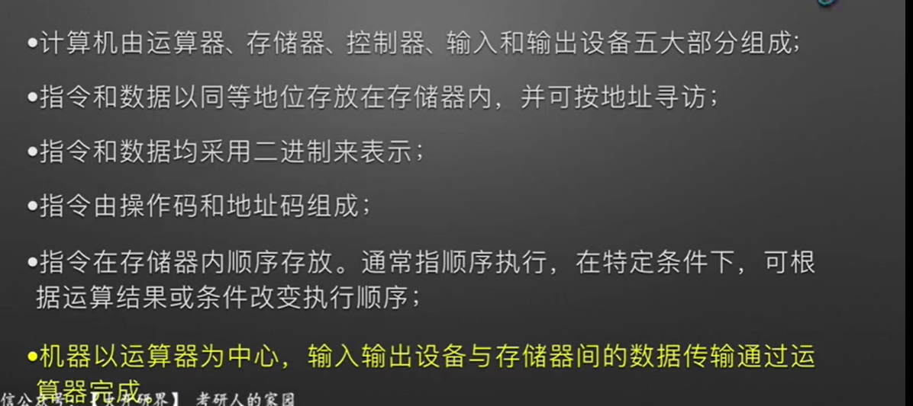
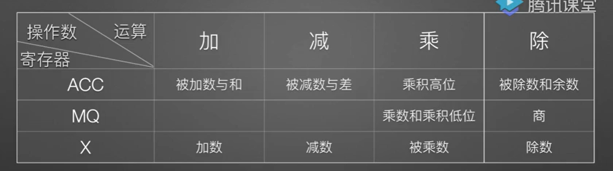
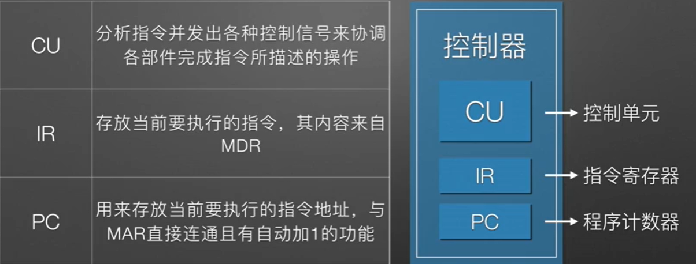
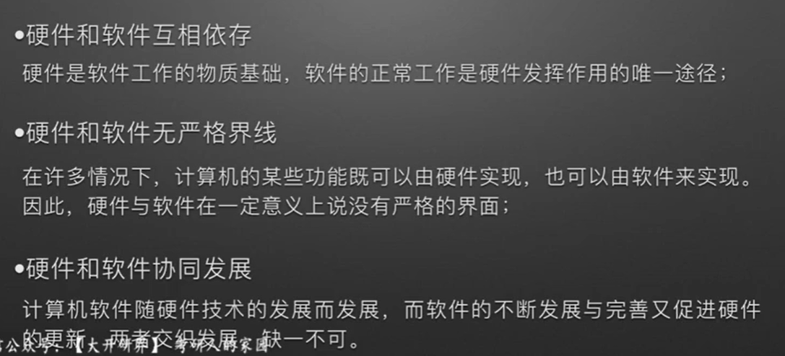
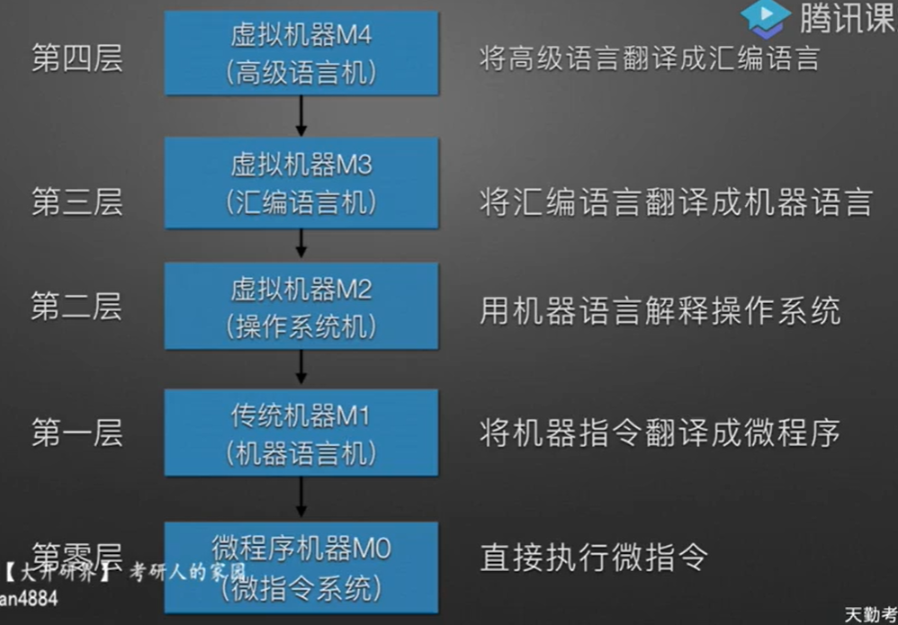

**计算机组成**  
硬件系统和软件系统共同构成了一个完整的计算机系统。

- 计算机硬件
  - 冯诺依曼计算机特点
        
-  计算机功能部件
   - 存储器   
   分为主存和辅存。  
   主存按地址存取，存放二进制信息。基本组成MAR、MDR、存储体和外部时序控制逻辑。  
   MAR的位数对应存储单元的个数，与PC长度相等  
   MDR位数与存储字长相等。  
   MAR、MDR在现代计算机中存在于CPU中 

   - 运算器  
   用于进行逻辑(加、减、乘、除)和算术运算(与、或、非、异或、比较)。  
   **基本组成是 ALU(算术逻辑单元)、ACC(累加器)、MQ(乘商寄存器)、操作数寄存器(X)**、变址寄存器(IX)、基址寄存器(BR)、**PSW(程序状态寄存器)**。
   

   - 控制器  
   计算机的指挥中心。由PC、IR、CU构成
   

   -  I/O  
   I/O子系统包括各种I/O设备及其相应的接口，接受CU的控制命令，完成相应的操作。 
   将信息转换成用户和计算机双方能接受的形式。  
- 计算机软件  
  - 软件  
    - 系统软件  
    保证计算机系统高效、正确运行的基础软件，通常作为系统资源提供给用户使用。  
    主要有操作系统(OS)、数据管理系统(DBMS)、语言处理程序、分布式软件系统、网络软件系统、标准库程序、服务性程序
    - 应用软件  
    解决某一领域中的各类问题而编址的程序
  - 语言  
    - 机器语言
    - 汇编语言
    - 高级语言
- 硬件和软件关系
    
    

 

**计算机系统层次结构**

