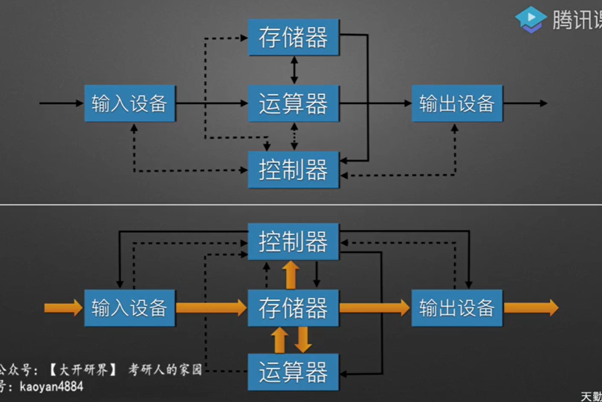

### 计算机各个部分功能

### 计算机不同的组织方式

### 冯诺依曼计算机特点

计算机组成和计算机体系结构是不同的两个概念
- 计算机体系结构
程序员能够看到计算机系统的属性，计算机系统具有多级层次，站在不同层次上编程的程序员所看到的计算机属性也各不相同。而裸机的属性有指令集、数据结构、存储器寻址技术、I/O机理
- 计算机组成
计算机体系结构的具体实现，对程序员是透明的  

### 计算机系统组成
**计算机硬件系统**
- 依照冯·诺依曼体系结构，计算机硬件系统由五部分组成：运算器、控制器、存储器、输入设备和输出设备  

**计算机软件系统**  
- 分为系统软件和应用软件

### 计算机软件和硬件的关系

### 高级语言到与机器语言之间的转换

