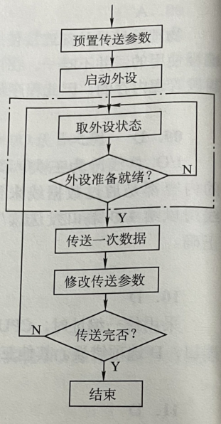
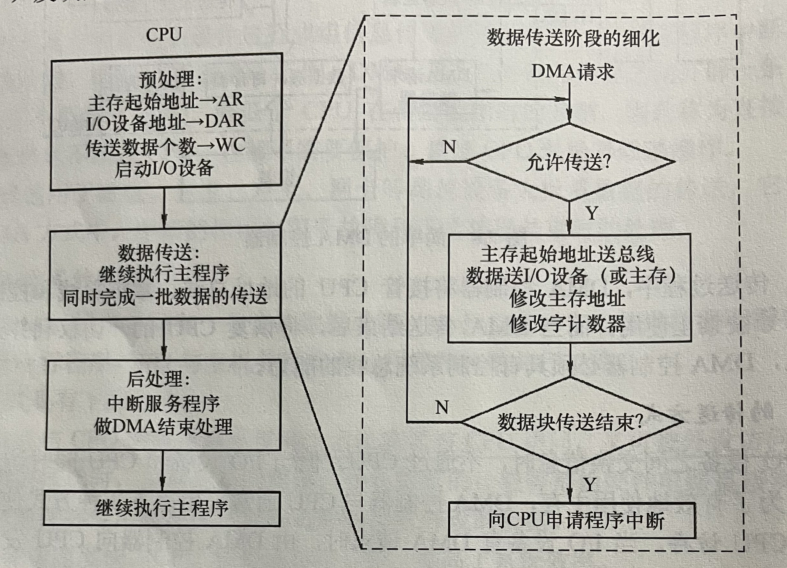

**I/O方式**  
主机与I/O设备之间数据传送的不同控制方式  
- 程序查询方式  
完全由CPU执行程序实现，通过在程序查询方式接口中设置一个数据缓冲器和设备状态缓冲器。  
  

- 程序中断方式  
CPU在程序中启动某台外设，然后CPU继续执行当前程序。一旦外设准备就绪就主动向CPu发送中断请求。CPU暂停当前程序，执行中断服务程序，完成主机和外设之家的数据传送。  

- DMA方式  
DMA方式是一种完全由硬件进行成组信息传送的控制方式。  
    - 特点  
        1. 使主存和CPU固定的联系脱钩，主存可被CPU访问，也可被I/O设备访问
        2. 数据块传送时，主存地址和传送数据的计数完全由硬件实现
        3. 开辟专用缓冲区，及时供给和接收外设数据
        4. DMA开始需要通过程序进行预处理，结束后要通过中断方式进行后处理  
    - 组成  
        1. 主存地址计数器  
        存放要交换数据的主存地址
        2. 传送长度计数
        3. 数据缓冲寄存器
        4. DMA请求触发器
        5. 控制/状态逻辑  
        由控制和时序电路及状态标志组成，用于指定传送传送方向
        6. 中断机构  
    - DMA和CPU冲突解决 
    当DMA和CPU同时访问主存时，可能发生冲突。 
        1. 停止CPU访存  
        冲突时，CPU让出总线，直到DMA传送结束后，将控制器交给CPU
        2. 周期挪用(周期窃取)  
        DMA优先享有总线，但不强制占有 
        3. DMA与CPU交替访存  
        适用于CPU的工作周期比主存存取周期长的情况。  
    - DMA的传送过程  
        
        1. 预处理  
        完成必要的准备工作。测试I/O设备状态、设置DMA寄存器初值、传送方向、启动该设备。
        2. 数据传送  
        可以以字节为基本单位，也可以以数据块作为基本单位。
        3. 后处理  
        DMA控制器向CPU发送中断请求。
