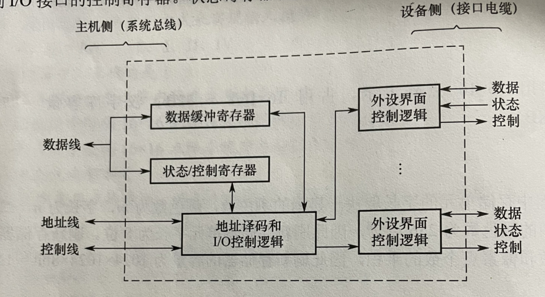

**I/O基本组成**  
- 外部设备  
输入、输出设备机通过输入、输出接口才能访问的外存储设备。  
- I/O接口(I/O控制器)  
是主机和外设之间的交接界面，通过接口可实现主机和外设之间的信息交换  
    - 主要功能  
        1. 地址译码和设备选择  
        CPU送来选择外设的地址码后，接口对地址进行译码以产生地址选择信息。  
        2. 实现主机和外设的通信联络控制  
        解决主机和外设时序配合问题，协调不同工作速度的主机和外设之间交换信息  
        3. 实现数据缓冲  
        消除速度差异  
        4. 信号格式转换  
        CPU和外设之间电平、数据格式都可能存在差异。接口应该提供计算机与外设的信号格式转换功能。    
        5. 传送控制命令和状态信息  
        

    - 基本结构  
     
      - 补充 
        - 接口的状态信息、CPU对外设的命令都是通过数据线传送的
        - 地址线用于给出要访问接口中寄存器的地址
        - 控制线传送读写信号  

    - 类型  
        - 按数据传送方式可分为并行接口和串行接口
        - 按主机访问I/O设备的控制方式，可分为程序查询接口、中断接口、DMA接口
        - 按功能选择的灵活性可分为可编程接口和不可编程接口
    - 端口编址 
    端口要想想被访问，必须对各个端口进行编号。  
        - 编址方式  
            - 统一编址  
            将I/O端口当做存储器的单元进行地址分配，不需要专门的I/O指令，用统一的访存指令可以访问I/O端口。  
            - 独立编址  
            I/O空间和主存空间是两个独立的地址空间。需要设置专门的I/O指令来访问I/O端口