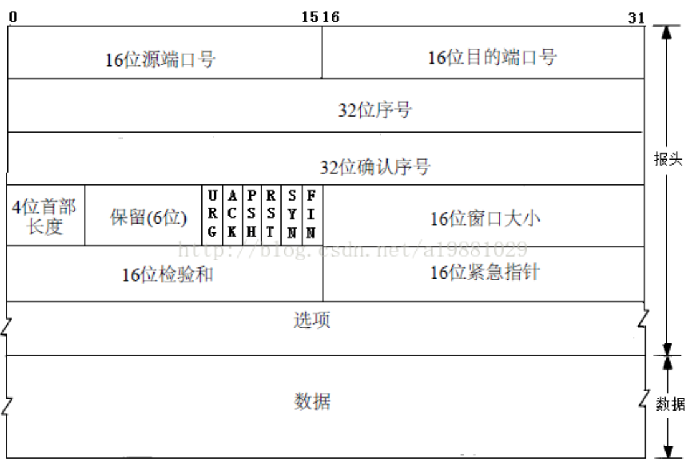

### TCP  
**特点**  
1. TCP面向连接的传输层协议
2. 每条连接只能由两个端点
3. TCP提供可靠的服务，保证传送的数据无差错、不丢失、不重复且有序
4. 全双工，连接双方都设有发送缓存和接收缓存
5. TCP面向字节流

**报文段**  

- 补充
  - 序号。每个字节都按顺序编号，序号字段的值是报文发送的第一个字节的序号。
  - 确认号。期望收到对方下一个报文段的第一个数据字节的序号
  - 数据偏移：首部长度，以4B为单位
  - URG位。为1时，告诉系统此报文段中有紧急数据，从数据第一个字节开始，到紧急指针所指的字节就是紧急数据
  - ACK位。ACK为1是，确认字段才有效，TCP固定在连接建立后所有传送的报文段必须把ACK置1。
  - PSH位。PSH为1时，暗示TCP尽快将报文交付给应用程序
  - RST位。为1时表示TCP连接出现差错，必须释放连接，然后重新建立连接
  - SYN位。SYN为1，且ACK为0，表示连接请求报文。SYN为1，ACK为1，连接同意响应报文。
  - FIN位。用来释放一个连接。

**连接管理**  
- 连接建立
  1. 开户机的TCP向TCP发送连接请求报文。SYN位置1，同时选择一个初始序号x .
  2. 向客户机发送确认，并为该TCP分配缓存和变量。SYN和ACK都置1，确认号为x+1，同时选择自己的初始序号
  3. 客户机向发送确认报恩，并为TCP连接分配缓存和变量。ACK置1，确认号为y+1,序号为x+1
  
- 连接释放(以客户机主动终止为例，服务器相同)  
  1. 客户机发送连接释放报文段，停止发送数据，主动关闭TCP。FIN位置1，序号假设为u
  2. 服务器发送确认。确认号 ack 为 u+1,信号假设为v
  3. 服务器如果没有要向客户机发送的数据后，通知TCP释放连接。FIN为1，信号为w(可能在关闭TCP连接之前需要发送数据),ack = u+1
  4. 客户端发送确认报文，确认号 ack = w+1,序号为u+1 

**可靠传输** 
- 序号  
保证数据有序的传给应用层
- 确认  
确认号是期望对方发送的下一个报文段的数据的第一个字节的序号  
TCP使用累积确认。TCP只确认数据流中第一个但是字节为止的字节
- 重传  
两种事件到时TCP重传 
  - 超时  
  TCP对每个发送的报文段设置一个计时器，并通过自适应算法设置超时时间
  - 冗余ACK  
  TCP规定每当接收到比期望序号大的失序报文段，就发送一个冗余ACK。  
  TCP固定发送方在接收到同一个报文3个冗余ACK时，就可以认为被确认的报文段已经懂事。并重发