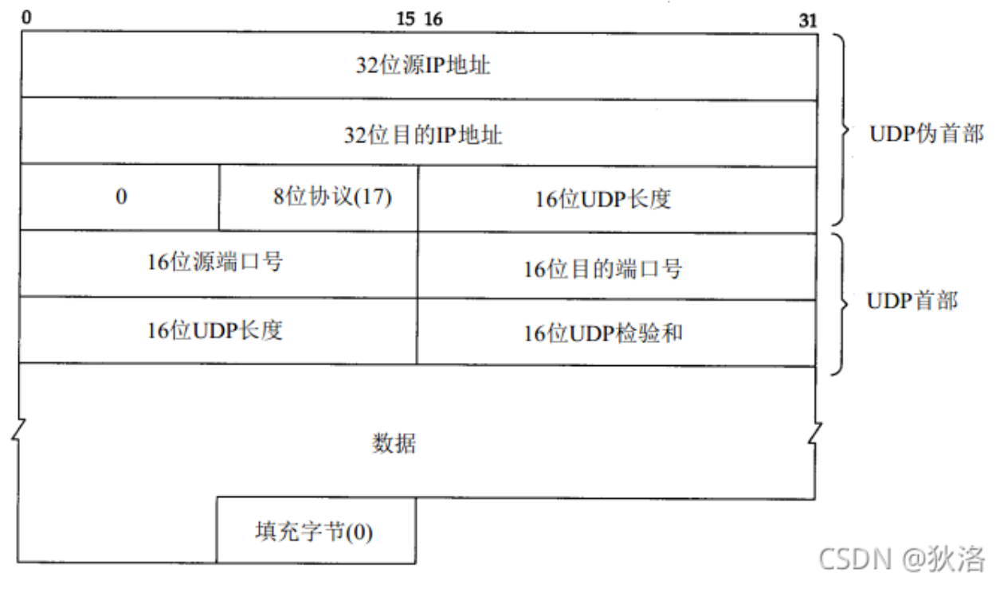

### UDP

**概述**  
UDP只是在IP之上增加了复用和分用以及差错检测功能。  

**优点**  
1. UDP无需建立连接
2. 无连接状态
3. 分组首部
4. 没有拥塞控制，能更好的控制发送的数据和发送时间
5. UDP支持一对一、一对多、多对一、多对多。

**首部格式**  

**UDP校验和**  
- UDP计算校验和的时候要加上伪头部  
- 过程
   1. 发送方首先把全零放入校验和字段并添加伪首部，若数据报数据部分不是偶数个字节，在末尾添加全零字节(但不发送)，把数据报视为16位的字串连接起来。
   2. 按二进制反码计算16进制求和，再将结果取反码填入校验码字段

**补充**  
- 多用于一次性传输较少数据的网络应用，如DNS、SNMP。
- UDP面向报文