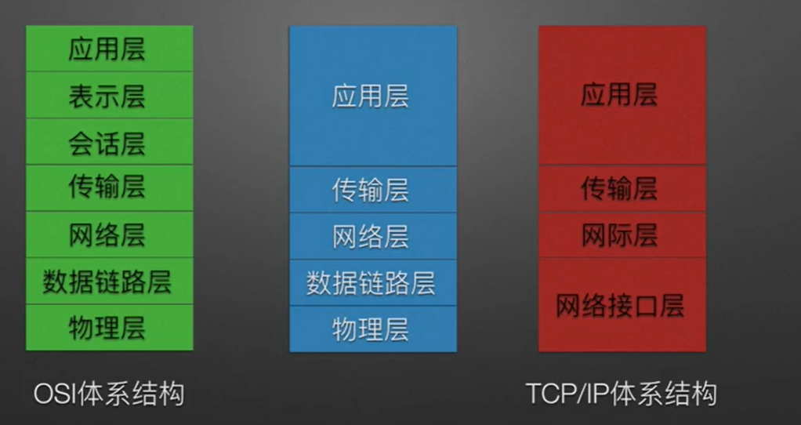

### 计算机网络分层结构  

**协议、接口、服务概念**  
- 协议  
协议就是规则的集合，控制两个对等的实体进行通信的规则集合，是水平的。  
协议由三部分组成:  
    1. 语法  
    规定传输数据的格式  
    2. 语义  
    规定所要完成的功能，包括规定控制信息、完成何种动作及做出何种应答
    3. 同步  
    规定了各种操作的条件、时序关系  

- 接口  
是同一结点内相邻两层间交换信息的连接点，是系统内部的规定  

- 服务  
指下层为紧邻的上层提供的功能调用，是垂直的。  
上层使用下层的提供的服务时必须与下层交换一些命令，这些命令称为服务原语。  
OSI将原语划分为4类:
    1. 请求
    2. 指令
    3. 响应
    4. 证实

    计算机提供的服务可分为：  
        1. 面向连接服务于无连接服务
        2. 可靠服务于不可靠服务
        3. 有应答服务和无应答服务

**ISO/OSI参考模型和TCP/IP参考模型**  

- 分层优点
    1. 各层相互独立
    2. 灵活性好
    3. 结构上可分开
    4. 易于实现和维护
    5. 促进标准化工作