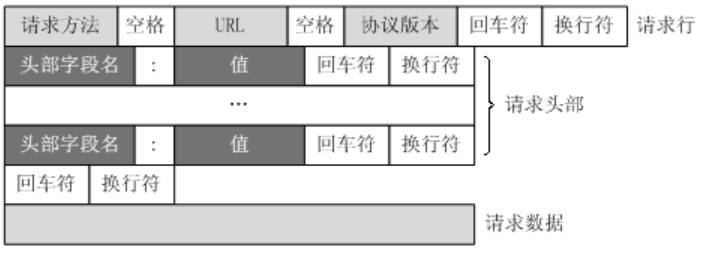
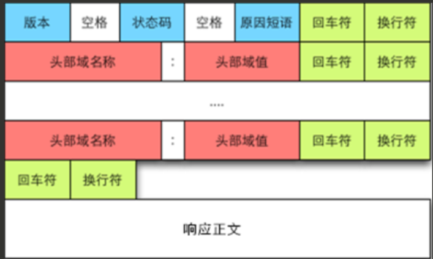

### 万维网  

**概念**  
万维网是一个分布式、联机式的信息存储空间。 

**组成**  
1. 统一资源定位符(URL <协议>://<主机>:<端口>/<路径>)  
负责标识万维网上的各种文档，在整个万维网中具有唯一性
2. 超文本传输协议(HTTP)  
应用层协议，使用TCP传输
3. 超文本标记语言(HTML)  

**工作流程**  
1. Web用户使用浏览器与Web服务器建立连接，并发送浏览器请求。
2. Web服务器把URL转换成文件路径，并返回信息给Web浏览器。  
3. 通信完成，关闭连接

**HTTP**  
- 特点  
1. HTTP是无连接，虽然使用TCP，但是不需要建立HTTP连接
2. HTTP无状态。第一次访问与第二次访问同一个服务器页面，响应相同。HTTP可利用cookie跟踪活动。
3. HTTP可使用持久连接也可使用非持久连接。  
    - 非持久连接  
    每次网页对象都需要单独建立一个TCP连接
    - 持久连接  
    万维网在发送响应之后仍维持这条连接。  
    持久连接也分为非流水线和流水线

- HTTP报文结构  
    - 请求报文
    
    - 响应报文
    