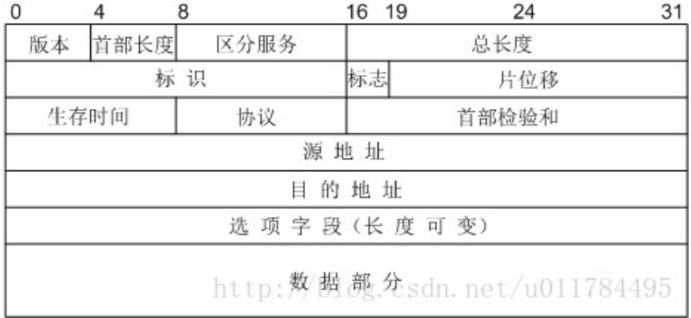

### IPv4

**协议格式**    

- 补充
  - 首部长度以4字节为单位，总长度以1字节为单位，片偏移以8字节为单位
  - 标识是一个计数器，不起序号作用，而是标识分片之后的数据是来自同一个数据报的
  - 标志有三位，最低位MF，表示数据后面是否还有分片，为1表示有，为0表示最后一个分片。中间一位是DF，只有为0时才允许分片。
  - 首部校验和只校验分组的首部

**IPv4地址**  
- IPv4分类  
互联网早期采用的IP地址方式。IP地址分成A(8,0)、B(16,10)、C(24,110)、D(,1110)、E(,1111)类。IP地址由网络号和主机号组成。
    - 补充
      - D类地址用于多播地址
      - 主机号全0和全1不分配，全0表示网络本身，全1表示广播地址
      - 