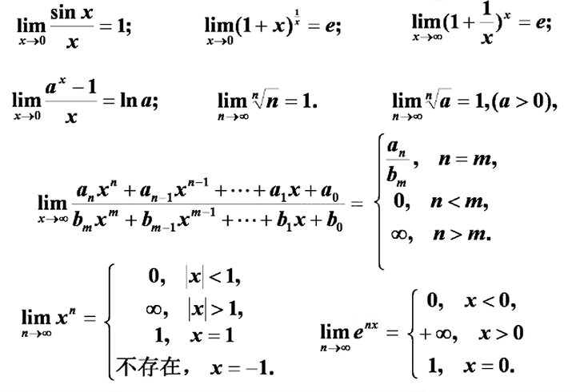
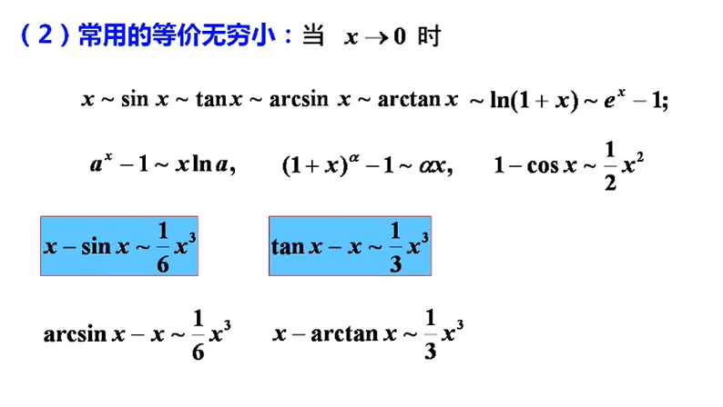

1. 利用基本函数求极限
- 
- $$1^\infty常用理论$$
  - $$若\lim\alpha(x) = 0,\lim\beta(x) = \infty,且 \lim\alpha(x)\beta(x) = A 则 \lim(1+\alpha(x))^\beta(x) = e^A$$
  - 归纳  
    - $$写标准形式\ \ \ 原式 = \lim[1+\alpha(x)]^{\beta(x)}$$
    - $$求极限 \lim\alpha(x)\beta(x) = A$$
    - $$写结果 原式 = e^x$$

2. 利用等价无穷小代换求极限
  - 代换原则
    - **乘除**关系可以换
      - $$若\alpha \sim \alpha1，\beta \sim \beta1则\\
      \lim\frac{\alpha}{\beta} = \lim\frac{\alpha1}{\beta} = \lim\frac{\alpha}{\beta1} = \lim\frac{\alpha1}{\beta1}$$
    - 加减关系在一定条件下可以换(两个减项不等价)
      - $$\alpha \sim \alpha1，\beta \sim \beta1，且\lim\frac{\alpha1}{\beta1} = A \ne 1,则\alpha - \beta \sim \alpha1 - \beta1$$
  - 常用的等价无穷小
    - 

3. 利用有理运算法则求极限
   - $$\lim f(x) = A,\lim g(x) = B\\
   \lim(f(x)\pm g(x)) = \lim f(x) \pm g(x)\\ \lim(f(x)*g(x)) = \lim f(x) * \lim g(x) \\ \lim\frac{f(x)}{g(x)} = \frac{\lim f(x)}{\lim g(x)} (B\neq 0)$$
      - $$存在 \pm 不存在 = 不存在 $$
      - $$不存在 \pm 不存在 = 不一定 $$
      - $$存在 \times \div 不存在 = 不一定 \\(\lim_{x \rightarrow \infty}\frac{1}{n}(存在)\times \lim_{x \rightarrow\infty} n(不存在) = 1) $$
      -  $$不存在 \times \div 不存在 = 不一定 \\ (-1)^n \cdot (-1)^n = (-1)^{2n}$$